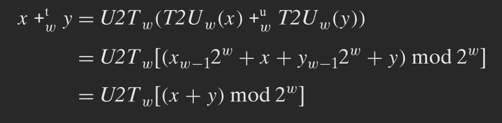

# Exercise Session 2
## Problem 2.17 (s. 101) (særlig vigtig)

| Hexadecimal | Binary | $B2U_4$        | $B2T_4$ |
| :---------: | :----: | :------------: | :-----: |
| 0xA         | 1010   | $2^3+2^1 = 10$ | $-2^3+2^1=-6$ |
| 0x1         | 0001   | $2^0=1$        | $2^0=1$ |
| 0xB         | 1011   | 11             | -5      |
| 0x2         | 0010   | 2              | 2       |
| 0x7         | 0111   | 7              | 7       |
| 0xC         | 1100   | 12             | -4      |

## Problem 2.21 (s. 112) (særlig vigtig)
| Type | Evaluation |
| :--: | :--------: |
| unsignned | false |
| signed    | false |
| unsigned  |

## Problem 2.29, delopgave 1 delopgave 5 (s. 129) (særlig vigtig)


## Problem 2.30 (s. 130) (særlig vigtig)
```
return (x < 0 && x < 0 && x + y >= 0) || (x > 0 && y > 0 && x + y <= 0);
```

## Problem 2.31 (s. 130)
This will always evaluate to true

## Problem 2.16 (s. 94)
Didn't bother just remember that shifting does not change the word length.

(NB Fejl i besvarelsen i bogen: 0x64 >>(arith)  3=0x0C, 0x44>>(arith) 3=0x08)

## Problem 2.40 (s. 139)
```
(x << 3) - x
(x << 5) - (x << 1)
(x << 5) - (x << 2)
(x << 6) - (x << 3) - x
```

## P1 opgaven nedenfor
P1 Opgave: her er et kode-fragment far et P1 project

```
encrypt(data[i].cpr, 0xfbca);

void encrypt(char password[], unsigned long key) {
    unsigned long i = 0;

    for (i = 0; i < strlen(password); i++) {
        password[i] -= key;
    }
}
```

1. Hvilke mindre værdier af nøglen 0xFBCA, giver samme ciffertext?

    Den sidste byte er hvad der har betydning for password[i]

2. Hvad er tal-intervallet for password[i] og key?

    password[i] er 0..256

    key er 0..2^64 - 1

3. Hvordan bliver udtrykket i linie 253 evalueret (signed/unsigned)?

    unsigned

4. Er der nogle værdier af key som ikke krypterer password? Hent: se på brug af strlen.

    0x0

    probably more

## Challenge 0 (se "download-materiale" mappen i VM; tryk på "Opdater download filer" på skrivebordet; alternativt: https://people.cs.aau.dk/~bnielsen/CART/)


## Challenge 1
