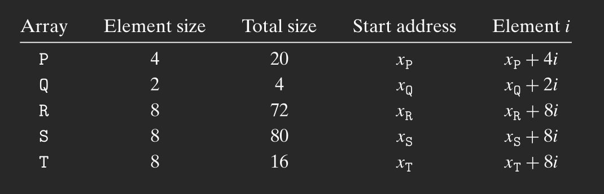
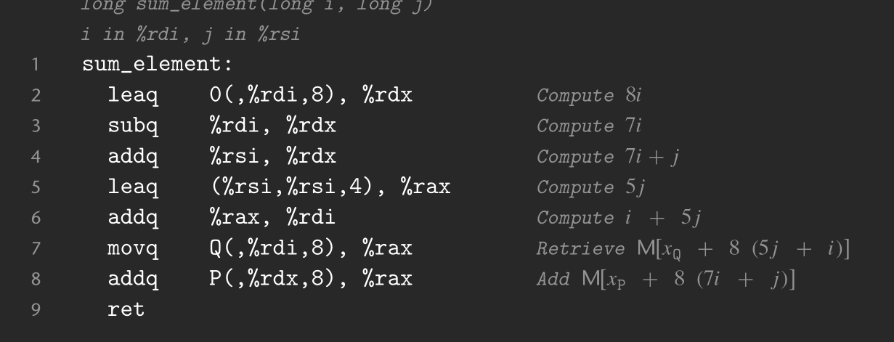

# Practice Problem 3.16
```
if (a == 0) goto done;
if (a < *p) goto done;
*p = a;

done:
    return;
```

Because we have to make two comparisons, which we in C can do in one if statement but not in assembly.

# Practice Problem 3.17
```
long absdiff_se(long x, long y) {
    long result;
    if (x < y)
        goto true;
    result = x - y;
    return result;

    true:
        resurt = y - x;
        return result;
}
```

probably some small optimisation

# Practice Problem 3.21
```
short test (short x, short y) {
    short val = y + 12;
    if (x & x < 0) {
        if (x >= y) {
            val = y | x
        } else {
            val = x * y;
        }
    } else if (y > 10) {
        val = x / y
    }
    return val;
}
```

# Practice Problem 3.26


# Proctice Problem 3.38

