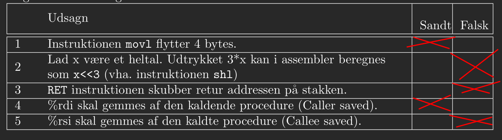
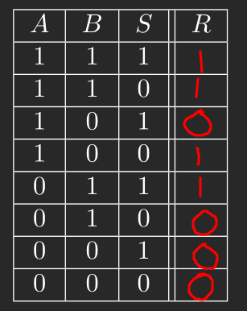
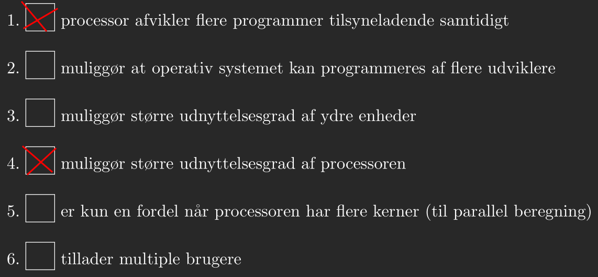
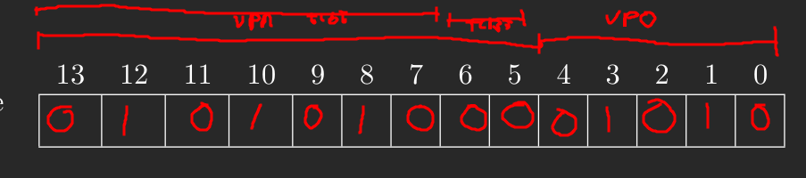

# Exercise 1
## 1.1
| Expression | Binary representation | Value (decimal) |
| :--------: | :-------------------: | :-------------: |
| x1         | 00 0000 0000 0000     | 0               |
| x2         | 11 1111 1111 1111     | $2^{14} - 1 = 16383$ |
| y1         | 10 0000 0000 0000     | $-2^{13} = -8192$ |
| y2         | 01 1111 1111 1111     | $2^{13} - 1 = 8191$ |

### 1.2
| Nr. | Expression | Result | Explanation |
|:---:| :--------: | :----: | :---------- |
| 5   | $y2+y3$    | $-8192$ | We have a carry bit all the way to the most significant bit resulting in positive overflow. |
| 6   | $y1-y3$    | $8191$  | Here we have the opposite we subtract one from the lowest possible value for an integer, thus resulting in negative overflow. |
| 7   | $y1+x1$    | $8192$ | Assuming these are C expressions we have that in an expression containing both unsigned and signed values we will do unsigned arithmetic. |
| 8   | $x2+y3$    | $0$ | Again we will do unsigned arithmetic, however we also have overflow. |
| 9   | $(y1+y2==0)$ | $0$ | The expression can be simplified to $(-1==0)$ which we can quickly see is false. |
| 10  | $(-y1==y1)$ | $0$ | In two complement values have a unique representation, thus $-y1$ cannot equal $y1$ |

Ten is wrong.

# Exercise 2
## 2.1

| Nr. | Expression | Answer |
|:---:| :--------: | :----: |
| 1   | `x\|y`     | 0xEA
| 2   | `x ^ ~y`   | 0x9D   |
| 3   | `y << 4`   | 0xA0   |
| 4   | `x >> 3` (logisk) | 0x19 |
| 5   | `x >> 3` (aritmetisk) | 0xF9 |

# Exercise 3
## 3.1


# Exercise 4
## 4.1
From the use of the registers rsi and rdi we can see that there are two arguments and they are used as integers. We also store results in rax which is the return value. Thus we get.

`int f(int, int)`

We selectively choose if the value in rax should be negated which would suggest the use of an if statement.


## 4.2
| PC | Instruction | %rdi   | %rsi   | %rdx | %rax | SF |
|:--:| :---------: | :--:   | :--:   | :--: | :--: |:--:|
| 401617 | movq    | 601040 | 601030 |
| 40161b | imul    |        |        |      | 5
| 40161f | movq    |        |        |      | 40   | 0  |
| 401622 | imul    |        |        | 6    |
| 401627 | subq    |        |        | 42   |
| 40162a | js      |        |        |      | -2   | 1  |
| 40162e | neq     |
| 401631 | jmp     |        |        |      | 2    | 0  |
| 40162c | retq    |

# Exercise 5
## 5.1


# Exercise 6
## 6.1
```
Fetch
icode:ifun <- M1[0x77774402] = A:0
rA:rB <- M1[0x77774403] = 6:F
valP <- 0x77774404

Decode
valA <- R[%rsi] = 0x3
valB <- R[%rsp] = 0x348

Execute
valE <- valB + (-8) = 0x340

Memory
M8[0x340] <- 0x3

Write back
R[%rsp] <- 0x340

PC update
PC <- 0x77774404
```

# Exercise 7
## 7.1
```
typedef struct vec {
    long x;
    leng y;
} vec_t;

#define N 10000
vec_t v[N];

void calc(vec_t *v, const int Length, long* calcResult) {
    int i;
    long res1 = 0,
         res2 = 0,
         res3 = 0;

    // There may be edge case in the loop exit condition
    for (i = 0; i < Length - 2; i += 3) {
        res1 += v[i].x     * v[i].x     + v[i].y     * v[i].y;
        res2 += v[i + 1].x * v[i + 1].x + v[i + 1].y * v[i + 1].y;
        res3 += v[i + 2].x * v[i + 2].x + v[i + 2].y * v[i + 2].y;
    }

    for (; i < Length; i++) {
        res1 += v[i].x * v[i].x + v[i].y * v[i].y;
    }

    *calcResult = res1 + res2 + res3
}

int main() {
    long res;
    calc(v, N, &res);
}
```

# Exercise 8
## 8.1


## 8.2
- b
- c
- c
- c
- c

# Exercise 9
## 9.1


- VPN: 0 1010 1000, 0A8
- TLB indeks: 00, 0
- TLB tag: 010 1010, 2A
- TLB: N
- Page fault: N
- PPN: 06

0000 1100 1010

## 9.2
010101111.01010

- VPN: 1010 1111, AF
- TLB index: 11, 3
- TLB tag: 0101011, 2B
- TLB hit: N
- Page fault: Y

## 9.3
000000110.01111

- VPN: 0000 0110, 06
- TLB index: 10, 2
- TLB tag: 000 0001, 01
- TLB hit: Y
- PPN: 19

0011001.01111

# Exercise 10
```
#include <stdio.h>
#include <stdlib.h>
#include <pthread.h>
#include "common.h"
#include "common_threads.h"

const int N=3;
long arr[9]={1,2,3, 4,5,6, 7,8,9};
long sum[3]={0,0,0};

pthread_mutex_t lock = PTHREAD_MUTEX_INITILIAZER;
pthread_cond_t cond = PTHREAD_COND_INITILIAZER;
int reached = 0;

void *mythread(void *arg) {
    long id=(long)arg;
    printf("Traad %ld: start\n", id);

    long total=0;
    for(int i=0;i<N;i++) {
        total+= arr[id*N+i];
    }
    sum[id]=total;

    printf("Traad %ld: foer: %ld\n", id, total);

    pthread_mutex_lock(&lock);
    reached++;
    while (reached < 3) pthread_cond_wait(&cond, &lock);
    pthread_cond_signal(&cond);
    pthread_mutex_unlock(&lock);

    total=0;
    for(int i=0;i<N;i++) total+=sum[i];
    printf("Traad %ld: efter: %ld\n", id, total);

    //fortsat beregning; ikke en del af opgaven.
    return NULL;
}

int main(int argc, char *argv[]) {
    pthread_t t1, t2,t3,t4;
    Pthread_create(&t1, NULL, mythread, (void*)0);
    Pthread_create(&t2, NULL, mythread, (void*)1);
    Pthread_create(&t3, NULL, mythread, (void*)2);
    Pthread_join(t1, NULL);
    Pthread_join(t2, NULL);
    Pthread_join(t3, NULL);
    return 0;
}
```

Should have used broadcast, but should still work.
