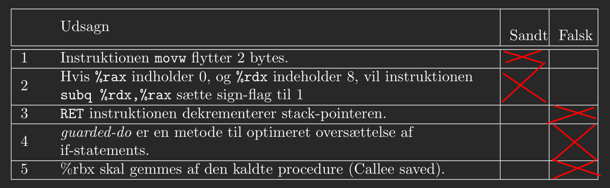
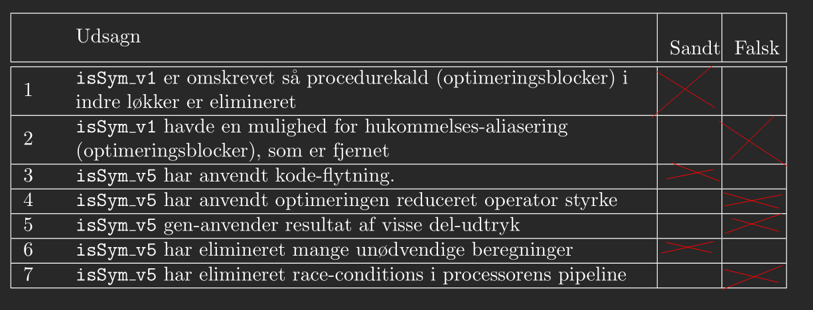
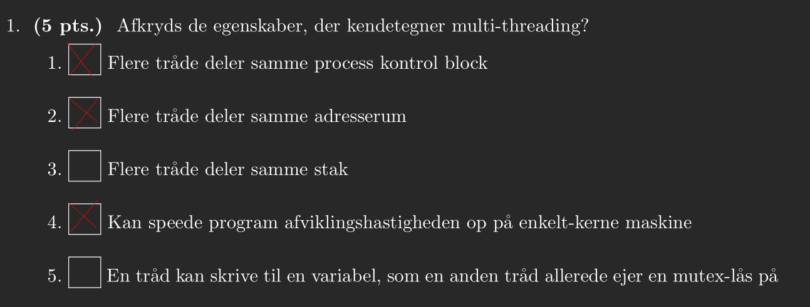

# CAOS Exam 14-06-2022
**Name:** Benjamin Clausen Bennetzen

**Student ID:** 20204861

# Exercise 1
## 1.1
1. a1: 100 0000 0000 0000 = $-2^{14} = -16384$
2. a2: 011 1111 1111 1111 = $2^{14} - 1 = 16383$
3. b1: 000 0000 0000 0000 = $0$
4. b2: 111 1111 1111 1111 = $2^{15} - 1 = 32767$

## 1.2
5. b2+b2: $32766$, In each addition of a single bit there will be two ones and an additional carry bit, the only place where this does not happen is in the zeroth position where we make the first carry bit.
6. a2+a3: $16375$, here we can do regular arithmetic as isn't any kind of overflow.
7. a1+a3, $16374$, Here we get a negative overflow and thus wrap around to the positive values.
8. b2+a1: $32759$, We have a mix of types, where unsigned takes priority, thus we read a1 as an unsigned integer.
9. (-a2==a2): 0, To get the negation in two complement we take the complement and add 1, this yields 100 0000 0000 0001.
10. (a3 < b1): 0, a3 will be read as unsigned integer and there cannot possibly less than 0.

# Exercise 2
## 2.1
```
unsigned char x = (((w >> 24) & 0xFF) << 8) | (w & 0xFF)
```

## 2.2
```
w = ~w
```

# Exercise 3
## 3.1


# Exercise 4
## 4.1
I'll assumme that $\%rdi = t1$. $\%rsi = t2$, $\%edx = t3$ and $\%eax = t4$.

| 7 | 6 | 5 | 4 | 3 | 2 | 1 | 0 | Address |
|:-:|:-:|:-:|:-:|:-:|:-:|:-:|:-:|:-------:|
|   |   |   |   |   |   |   |   | 0xfa658 |
|   |   |   |   |   |   |   |   | 0xfa650 |
|   |   |   |   |   |   |   |   | 0xfa648 |
|   |   |   |   |   |   |   |   | 0xfa640 |
|   |   |   |   |   |   |   |   | 0xfa638 |
|   |   |   |   |   |   |   |   | 0xfa630 |
|   |   |   |   |   |   |   |   | 0xfa628 |
| R | R | R | R | R | R | R | R | 0xfa620 |
| B | B | B | B | B | B | B | B | 0xfa618 |
|t4 |t4 |t4 |t4 |t4 |t4 |t4 |t4 | 0xfa610 |
|   |   |   |   |   |   |   |   | 0xfa608 |
|t1 |t1 |t1 |t1 |00 |00 |00 |00 | 0xfa600 |
|t2 |t2 |t2 |t2 |   |   |t4 |t4 | 0xfa5f8 |
|   |   |   |   |   |   |   |   | 0xfa5f0 |

## 4.2
```
p1 + p3 < 0 ? 2p3 : p2
```

# Exercise 5
## 5.1
```
E = (a ^ b) ^ (C ^ P)
```

## 5.2
```
E = (0 ^ 0) ^ (0 ^ 1) = 0 ^ 1 = 1
```

# Exercise 6
## 6.1
```
fetch
icode:ifun <- M1[0x400] = 6:1
rA:rB <- M1[0x401] = 2:0
valP <- 0x400 + 2 = 0x402

decode
valA <- R[%rdx] = 0x10
valB <- R[%rax] = 0x0

execute
valE <- 0x0 - 0x10 = 2**64 - 1 - 15
ZF <- 0
SF <- 0
OF <- 1

memory

Write back
R[%rax] <- 2**64 - 1 - 15

PC update
PC <- 0x402
```

# Exercise 7
## 7.1
isSym_v1 er mest cache venlig. Here we go through the matrix in a rowwise and reverse rowwise order which is better than v2 which goes in a column wise and reverse column wise order.

## 7.2
2x1. We do two steps in each iteration but only have a single variable two hold results.

## 7.3


# Exercise 8
## 8.1


## 8.2
Since we are using proceses changing the value of v in the true clause will not change the value of v in the else clause.
```
A3
B3
C1

B1
A3
C1
```

# Exercise 9
## 9.1
1. Bits in the virtual address

    00 0011 0.111 1010
2. Address translation
    - VPN: 000 0110
    - TLBI: 10 = 2
    - TLBT: 0 0001 = 0x01
    - TLB HIT: J
    - Page fault: N
    - PPN: 0x19
3. Bits in physical address

    1100 1.111 1010

## 9.2
1. Bits in the virtual address

    11 0100 1.011 1100

2. Address translation
    - VPN: 110 1001 = 0x69
    - TLBI: 01 = 1
    - TLBT: 1 1010 = 0x1A
    - TLB HIT: N (valid bit 0)
    - Page fault: N
    - PPN: 0x17
3. Bits in physical address

    1011 1.111 1010

## 9.3
1. Bits in the virtual address

    11 0100 0.111 1111

2. Address translation
    - VPN: 110 1000 = 0x68
    - TLBI: 00 = 0
    - TLBT: 1 1010 = 0x1A
    - TLB HIT: N (valid bit 0)
    - Page fault: J (valid bit 0)
    - PPN: Not found

# Exercise 10
In the following exercises i have chosen not to do any error handling (or checking for that matter). Obviously this should be done in production code.

## 10.1
```
sem_t still_working;
sem_init(&s, 0, 1 - WORKERS);
pthread_mutex_t chunk_lock = PTHREAD_MUTEX_INITIALIZER;
pthread_mutex_t counts_lock = PTHREAD_MUTEX_INITIALIZER;
```

## 10.2
```
for (int i = start; i < end; i++) {
    int wordLen = strLen(input[i]);
    pthread_mutex_lock(&counts_lock);
    counts[wordLen]++;
    pthread_mutex_unlock(&counts_lock);
}

sem_post(&still_working);
```

## 10.3
```
sem_wait(&still_working);
```

## 10.4
```
pthread worker0,
        worker2,
        worker1;
        stats;
long id0 = 0,
     id1 = 1,
     id2 = 2;

pthread_create(&worker0, NULL, myWorker, (void *) id0);
pthread_create(&worker1, NULL, myWorker, (void *) id1);
pthread_create(&worker2, NULL, myWorker, (void *) id2);
pthread_create(&stats, NULL, computeStats, NULL);

void** res = NULL;

pthread_join(worker0, res);
pthread_join(worker1, res);
pthread_join(worker2, res);
pthread_join(stats, res);
```
